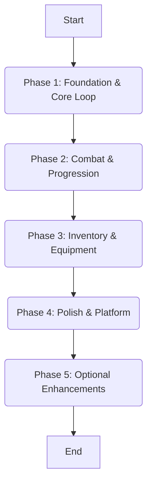

# Detailed Development Plan: Idle Fantasy RPG/MMO (Phaser.js)

This plan outlines a phased approach to developing the Idle Fantasy RPG/MMO using Phaser.js, incorporating idle mechanics, RPG progression, combat, and a robust save system.

## 1. Core Features Overview

The game will include the following key features:

* **Idle Mechanics**: Automated progression and battles, generating resources (gold, mana) even when the player is offline.
* **RPG Stats & Progression**: Character attributes (Strength, Intelligence, etc.), HP, mana, damage, experience points, and a leveling system that unlocks abilities or increases stats.
* **Equipment & Inventory**: Multiple gear slots (weapon, armor, accessories) with stat bonuses and rarity. A functional inventory system for consumables and loot, allowing real-time stat changes upon equipping/unequipping.
* **Dungeons & Combat**: Diverse dungeon areas featuring waves of monsters and bosses. Combat will be mostly automated, with characters fighting based on their stats and skills.
* **Save System (Local & Cloud)**: Local storage using HTML5 localStorage for seamless game state saving and loading. Optional cloud saves via a RESTful API or services like Firebase for cross-device synchronization.
* **Desktop Experience**: Packaging the Phaser game into a full desktop application using Electron or NW.js.
* **Multiplayer (Optional)**: Future integration for real-time or asynchronous multiplayer features such as cooperative dungeons, trading, or leaderboards, potentially using WebSockets/Socket.io or Firebase Realtime Database.

### 2. Overall Project Flow

The development will proceed in distinct phases, building upon the foundational elements.

### 3. Detailed Step-by-Step Plan

#### Phase 1: Foundation & Core Loop

This phase focuses on setting up the basic game structure, scene management, initial UI, and the core idle resource generation.

1. **Project Setup & Scene Management**
    * Initialize a new Phaser 3 project.
    * Define and implement core [`Phaser.Scene`](https://photonstorm.github.io/phaser3-docs/Phaser.Scene.html) classes:
        * [`Boot.js`](src/scenes/Boot.js): For initial game configuration and asset loading.
        * [`Preload.js`](src/scenes/Preload.js): To load all necessary game assets (images, spritesheets, audio).
        * [`MainMenu.js`](src/scenes/MainMenu.js): The main menu scene.
        * [`GameScene.js`](src/scenes/GameScene.js): The primary gameplay scene where idle mechanics and combat will occur.
    * Configure the Phaser game instance in [`main.js`](src/main.js) to manage scene transitions.

2. **Asset Integration**
    * Collect open-license medieval fantasy assets (sprites, tiles, UI icons, backgrounds).
    * Load assets in the `Preload` scene using `this.load.image()`, `this.load.spritesheet()`, etc., assigning unique keys for easy referencing.
    * Implement basic background and character sprite display in `GameScene.create()`.

3. **Basic User Interface (HUD)**
    * Design and implement essential HUD elements in `GameScene` using [`Phaser.GameObjects`](https://photonstorm.github.io/phaser3-docs/Phaser.GameObjects.GameObject.html) (e.g., `this.add.image()`, `this.add.text()`).
    * Display placeholder values for health, mana, and gold.
    * Create basic interactive buttons (e.g., for Inventory, Settings) using `setInteractive()`.

4. **Idle Resource Generation**
    * Implement a timed loop in `GameScene` to generate resources (e.g., gold, mana) passively.
    * Example: `this.time.addEvent({ delay: 1000, callback: () => { player.gold += goldPerSecond; }, loop: true});`
    * Ensure resource values are displayed and updated in the HUD.

5. **Basic Player Stats & Display**
    * Define a JavaScript object or class to model the player's core stats (e.g., `player.js`).
    * Include base attributes (Strength, Agility, Intelligence) and derived stats (HP, attack power).
    * Display these stats in a dedicated UI panel within `GameScene`.

6. **Local Save/Load System**
    * Implement saving game state to [`localStorage`](https://developer.mozilla.org/en-US/docs/Web/API/Window/localStorage) using `JSON.stringify()` to serialize the `gameState` object.
    * Implement loading game state from `localStorage` using `JSON.parse()` on game startup.
    * Ensure the save data includes a timestamp for future offline progress calculation.

#### Phase 2: Combat & Progression

This phase introduces the automated combat system, dungeon mechanics, and player progression.

1. **Automated Combat System**
    * In `GameScene.update()`, implement the core combat logic.
    * Define enemy types and their stats (HP, damage).
    * Spawn enemies (e.g., using [`Phaser.Physics.Arcade.Group`](https://photonstorm.github.io/phaser3-docs/Phaser.Physics.Arcade.Group.html)) in waves.
    * Implement automatic damage application between player and enemies.
    * Handle enemy death, granting loot and experience points (XP) to the player.
    * Visually represent combat (e.g., simple attack animations, damage numbers).

2. **Dungeon & Enemy Spawning**
    * Create a system for defining dungeon levels (e.g., using Phaser Tilemaps or static images).
    * Implement scene transitions to a dedicated `DungeonScene` when the player enters a dungeon.
    * Spawn enemies appropriate to the current dungeon level.
    * Implement boss battles with stronger enemies and unique attack patterns.
    * Ensure progression allows unlocking new dungeons based on player level or achievements.

3. **XP & Leveling System**
    * Implement XP gain from defeated enemies.
    * Define an XP curve for leveling up.
    * When the player levels up, automatically increase base stats or allow for skill point allocation.
    * Update the player's stats display in the UI.

4. **Offline Progress Calculation**
    * On game load, calculate the elapsed time since the last save using the stored timestamp.
    * Simulate resource gains and potentially experience from auto-fights during the offline period.
    * Present an "offline gains" summary to the player upon resuming.

##### Phase 3: Inventory & Equipment

This phase focuses on developing the item system, inventory management, and equipment functionality.

1. **Item Data Definition**
    * Define item templates (e.g., weapon, armor, consumable) using JSON files or JavaScript classes.
    * Each item template should include properties like type, stat bonuses, rarity, and the sprite key for its visual representation.

2. **Inventory Management UI**
    * Create an inventory data structure (e.g., an array or list) to hold item instances.
    * Design and implement a grid-based inventory UI using Phaser GameObjects (Sprites or DOM elements).
    * Display item icons and basic information within the inventory slots.

3. **Equipment System & Stat Application**
    * Define specific equipment slots (e.g., weapon, helmet, chest, accessories).
    * Implement functionality to equip and unequip items.
    * When an item is equipped, apply its stat bonuses to the player's current stats.
    * When an item is unequipped, remove its stat bonuses.
    * Ensure player stats in the UI update in real-time as equipment changes.

4. **UI Interaction**
    * Make inventory item icons interactive using `sprite.setInteractive()`.
    * Implement click and/or drag-and-drop events for equipping/unequipping items.

#### Phase 4: Polish & Platform

This phase focuses on enhancing the game's visual appeal, performance, and preparing for desktop deployment.

1. **Game Loop Enhancements & Animations**
    * Refine the `GameScene.update()` loop to handle movement, combat ticks, and resource timers efficiently.
    * Define and implement Phaser Animations (`this.anims.create()`) for player actions (attack, idle, movement), enemy actions (attack, death), and other visual effects.
    * Play animations on sprites as corresponding actions occur.
    * Integrate Phaser Physics (e.g., Arcade Physics) for collision detection and overlap checks if dynamic interactions are needed.

2. **Desktop Packaging (Electron)**
    * Utilize Electron to wrap the Phaser game into a standalone desktop application.
    * Clone or adapt a "Phaser Runtime" Electron template.
    * Replace the template's game files with the developed Phaser game.
    * Configure Electron's `main.js` to set custom window sizes, titles, and enable local file system access if required.

3. **Testing & Balancing**
    * Continuously test each implemented system (idle gains, combat, inventory, save/load).
    * Balance idle gain rates to feel rewarding without being too fast or slow.
    * Verify that equipment correctly modifies player stats.
    * Thoroughly test the save/load system to ensure seamless resumption of gameplay.
    * Profile game performance using Phaser's debug tools and optimize sprite counts or other assets as needed.
    * Collect feedback and iterate on game balance, progression curves, and overall player experience.

#### Phase 5: Optional Enhancements

These features can be implemented after the core game is stable and functional.

1. **Cloud Save Integration**
    * Set up a backend service (e.g., Node.js with Express, Firebase) to handle cloud save data.
    * Implement API endpoints for saving (`POST`) and loading (`GET`) game state.
    * Modify the game's save system to send serialized JSON data to the backend.
    * Implement user authentication for cloud saves.

2. **Multiplayer Implementation**
    * Set up a dedicated server (e.g., Node.js with Socket.io) for real-time communication.
    * Define network protocols for syncing player actions (e.g., trading, cooperative dungeon entry).
    * Structure core game logic (stats, inventory) to be easily transmittable over the network.
    * Consider reusing the save system for persistent player accounts on the server.
    * Implement specific multiplayer features like cooperative dungeons, trading, or leaderboards.
